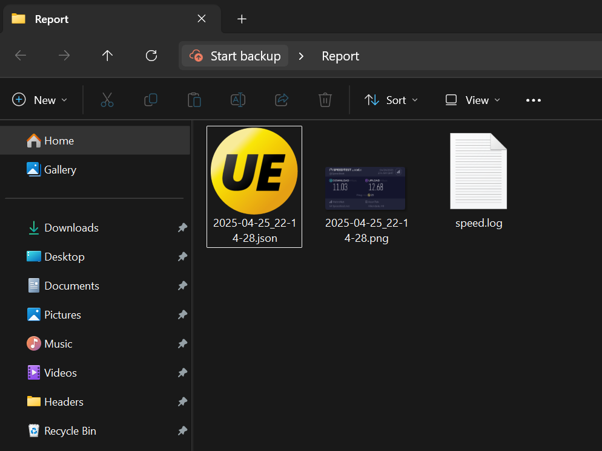

# Network-SpeedTest
Python script for automating SpeedTest-Cli

## Compilation
This code is meant be be run in GUI mode,  
please compile the Python binary via `pyinstaller` command:  
```cmd
pyinstaller speed.py --onefile --name Speed --windowed
```

## Report Generation
The test result will be stored in a newly created folder named `Report` in where the executable being invoked,  
inside the folder there will be three components:

1. \<timestamp>.json
2. \<timestamp>.png
3. speed.log

The `JSON` file will hold the raw content of the SpeedTest-Cli,  
and the `Png` image will be the visual summery of the test result,  
making it easier to interpret without needing to manually analyze the data.  
The `Log` file records runtime events for debugging and further inspection.


